# SDFTool
通过黑白图生成SDF图和SDF图集的小工具

##### 功能介绍

###### SDF生成

第一部分用来使用8ssedt算法生成SDF图，并将生成的SDF进行插值，得到用于卡通渲染的阈值图。

使用案例：

- 点击`选择路径`选择事先准备好的阈值图的路径：

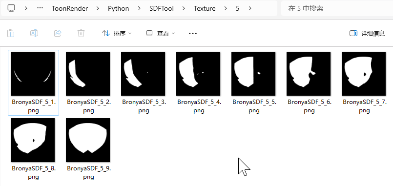

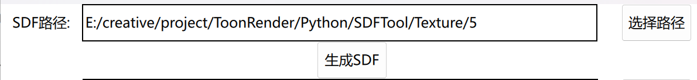

- 点击`生成SDF`，会在当前文件夹下生成一个output文件夹，在里面存储生成的SDF，插值生成的阈值图放在次级目录SDF里

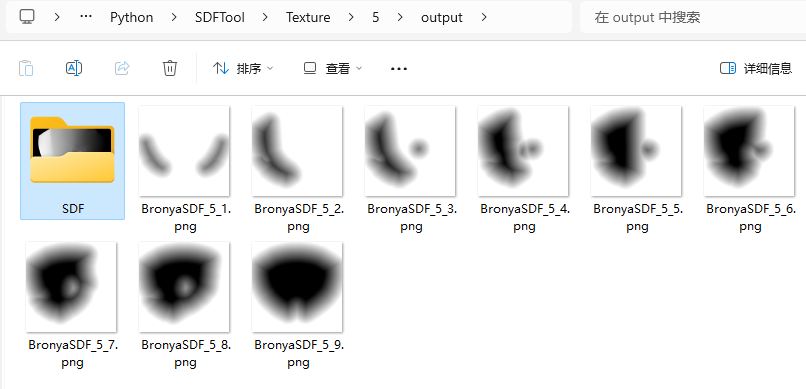

###### 图集生成

第二部分的图集生成的功能很简单，把一些相同尺寸的贴图合成一张图集使用

- 使用方式类似SDF生成，点击`选择路径`，选择存放贴图的路径：
- 命名格式建议参考下图，命名为image_1_1这样，末尾以“\_数字\_数字”结尾

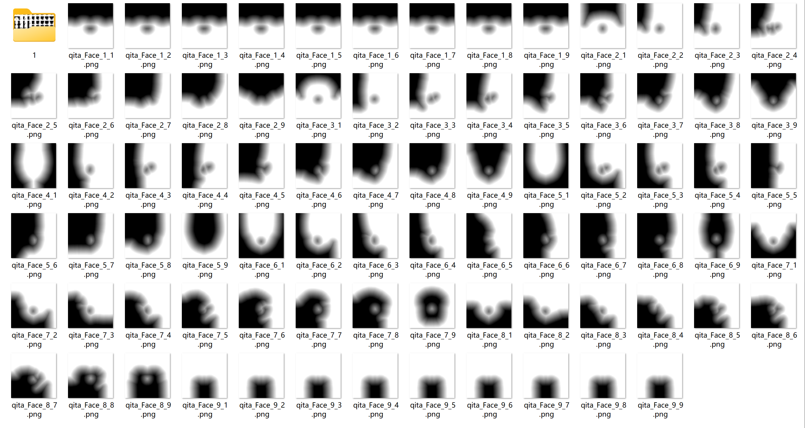

- 如果第一行贴图和最后一张贴图只准备了一张，如下图，记得勾选`首行和末行只有一张图片`

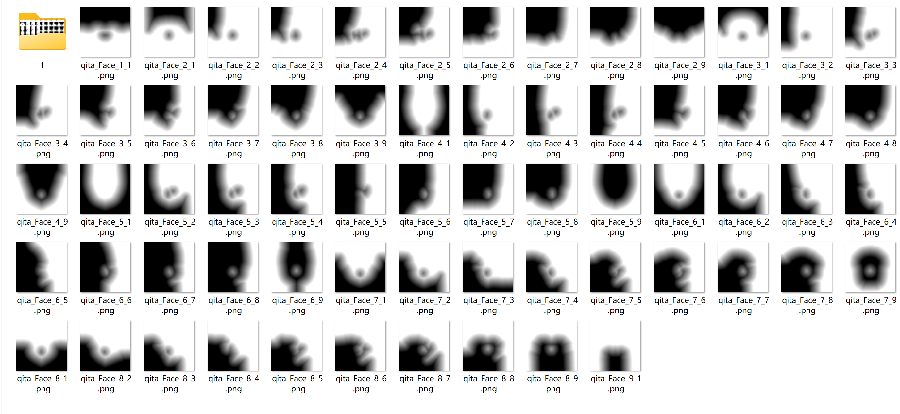

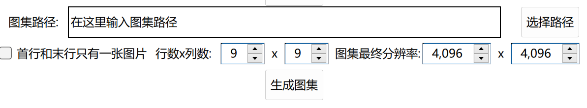

- `图集最终分辨率`是会在生成图集之后会按照这个分辨率重新插值一遍，比如上面我每张SDF贴图的分辨率都是1024，生成9x9的图集分辨率将会是9216x9216，有点太大了，所以用这个重新插值到4096x4096.

##### 安装源码

###### 项目介绍

首先先简单介绍一下这个小项目，方便你理解源码的安装步骤。

这个项目由三部分组成：项目的主要是用python写的，UI是使用QML写的，生成SDF的8ssedt算法是用c++写的。

所以想把项目跑起来主要需要安装好Pyside6等python的依赖和pybind11等c++的依赖。

###### C++部分

C++这边依赖于python，pybind11和opencv，需要把这三个东西安装好。

具体的安装流程可以参考下面链接里安装pybind11和opencv环境的教程：

https://blog.csdn.net/weixin_44244190/article/details/124977114

https://blog.csdn.net/CSDN_0007/article/details/106178140

项目的包含目录、库目录和附加依赖项可以参考我的设置（注意配置为Release）：

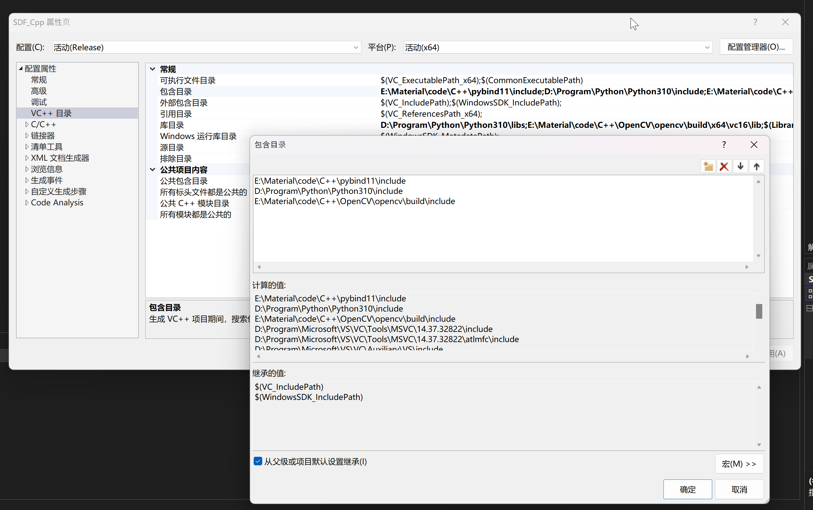

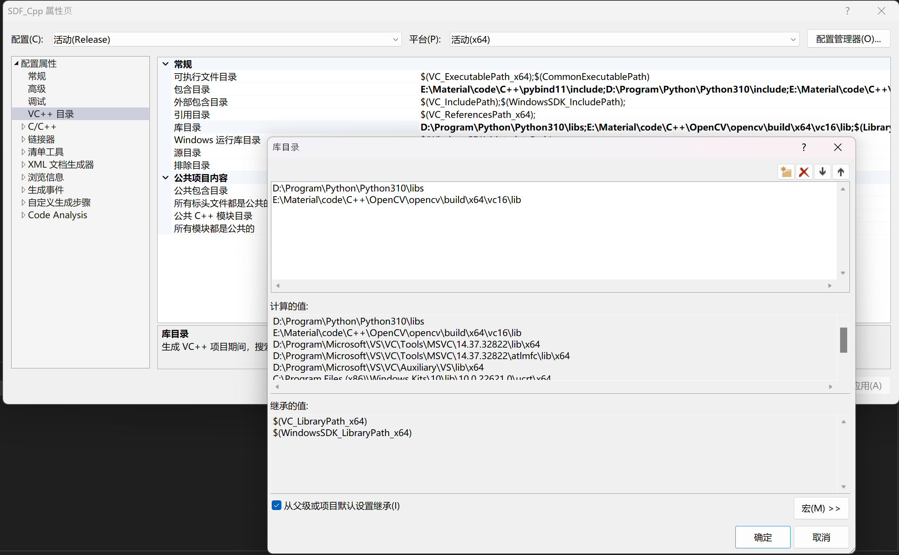

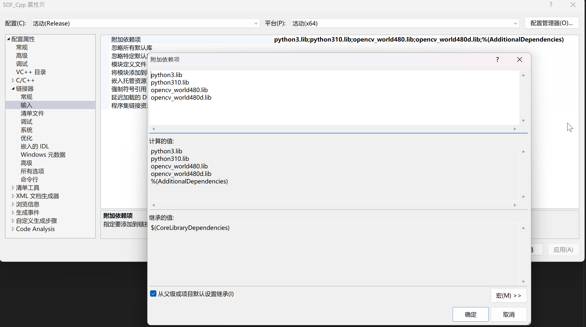

常规属性里注意配置类型选择dll，C++语言标准我选的是17

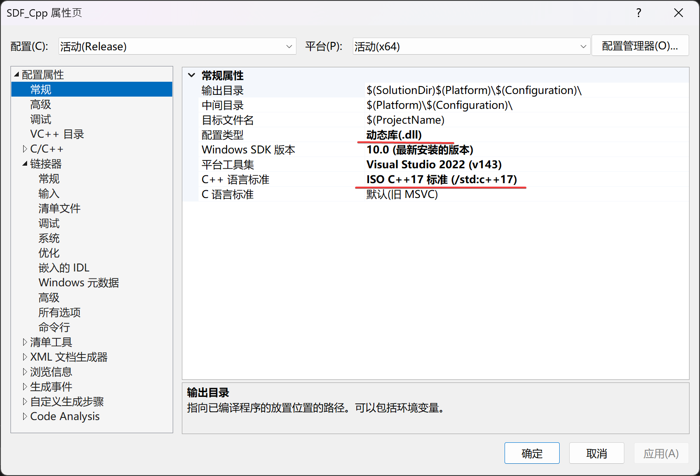

高级属性把目标文件扩展名改为.pyd

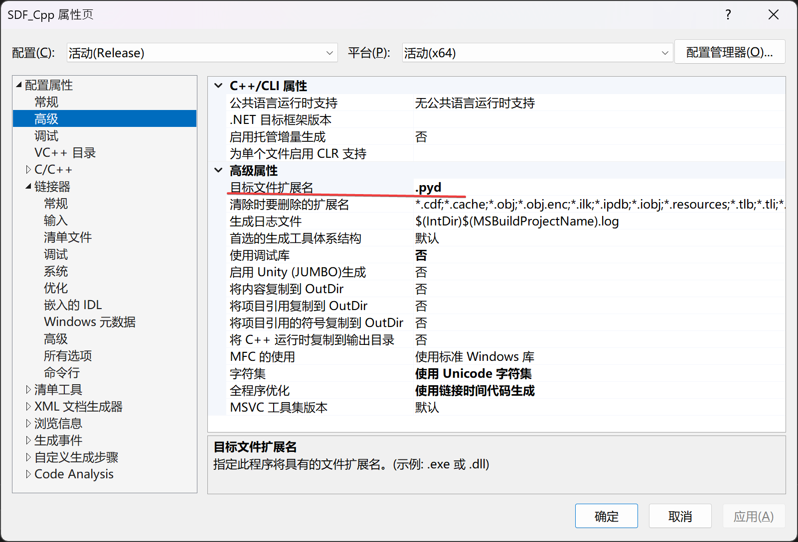

以上把python，pybind11和opencv都设置好了的话，右键项目点击生成应该可以下面的输出，生成的.pyd文件生成在x64\Release文件夹下

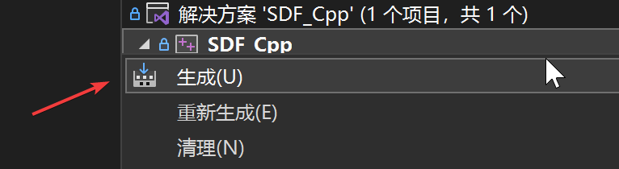


###### python部分

如果python使用pycharm开发，打开requirements.txt会自动给你在虚拟环境里安装好依赖

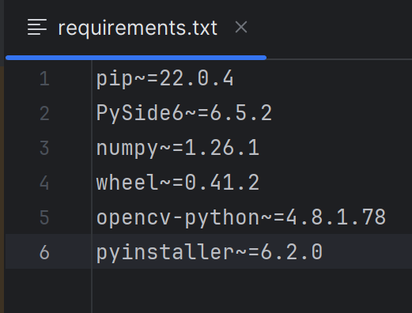

>  上面的pyinstaller是用来打包exe用的，可以不用装

注意项目设置设置虚拟环境时，python解释器的版本要和c++那边一致，比如c++那边我使用的是python3.10，这边也是


接下来注意main.py里的这几行代码：

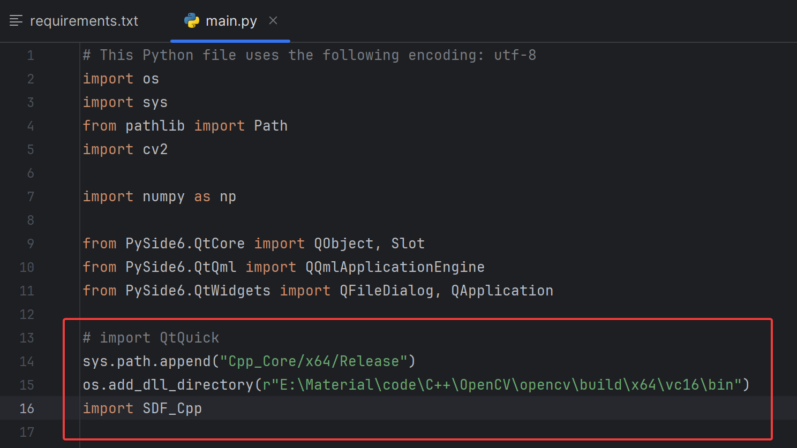

上面的第14行添加了SDF_Cpp.pyd的路径，用的是相对路径，所以下面import SDF_Cpp应该不会报错，但是第15这里我添加了opencv的dll的路径，这里使用的是绝对路径，你不改的话大概率会得到下面报错：

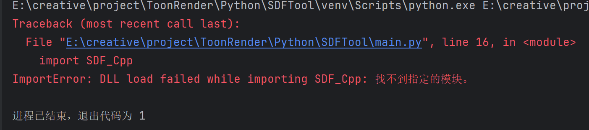

这里推荐使用一个工具"Dependencies"：

https://github.com/lucasg/Dependencies

使用这个工具打开C++生成的SDF_Cpp.pyd，可以看到这个pyd都依赖了哪些文件：

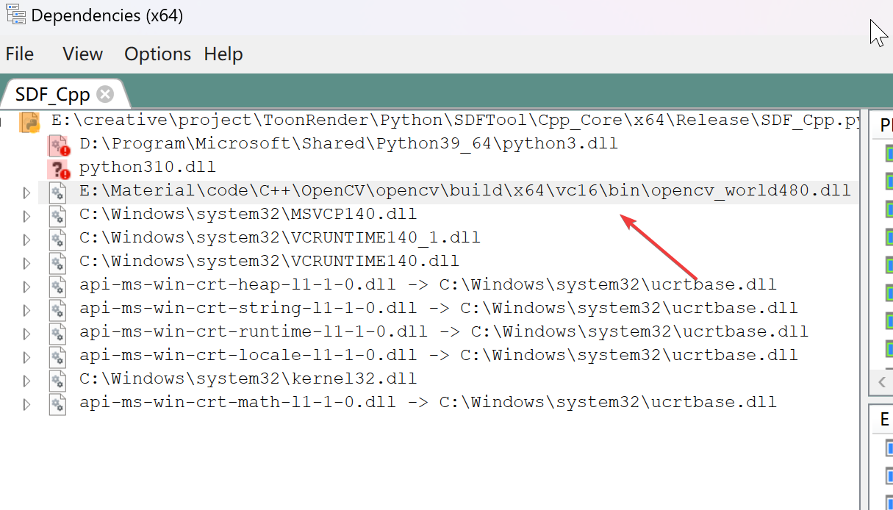

```python
os.add_dll_directory(r"E:\Material\code\C++\OpenCV\opencv\build\x64\vc16\bin")
```

替换上面opencv依赖目录路径为你的电脑里的路径。
